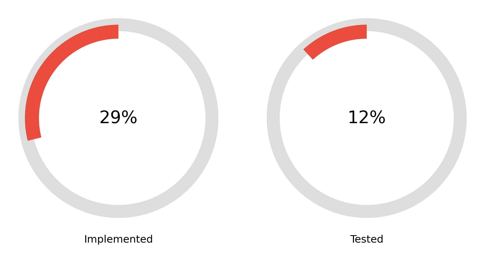
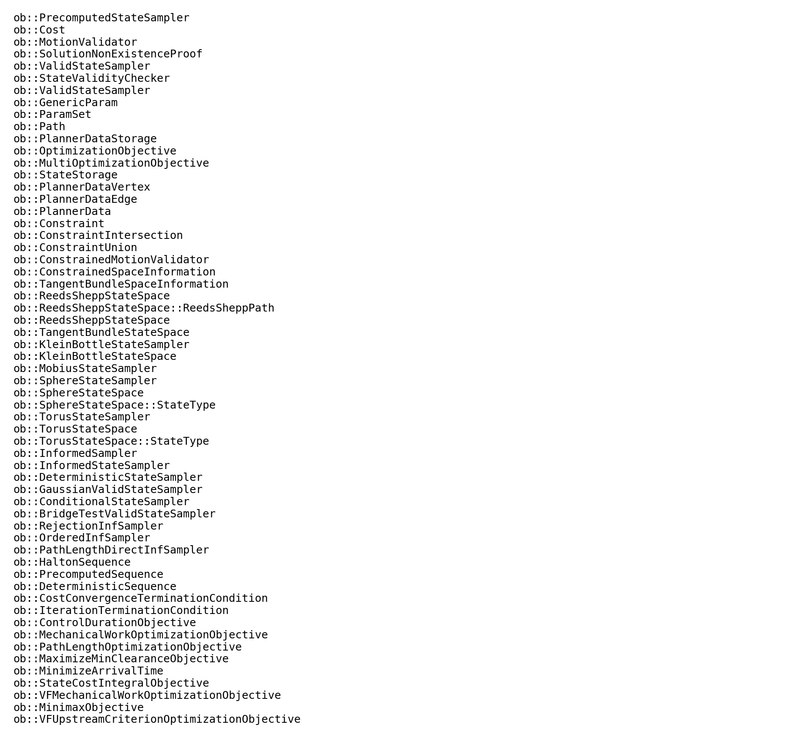
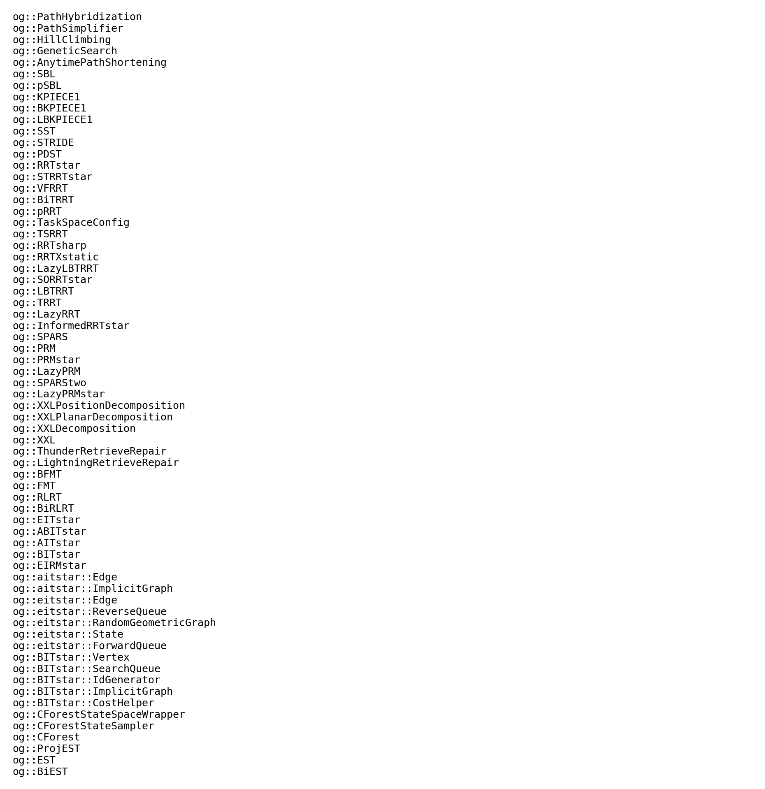
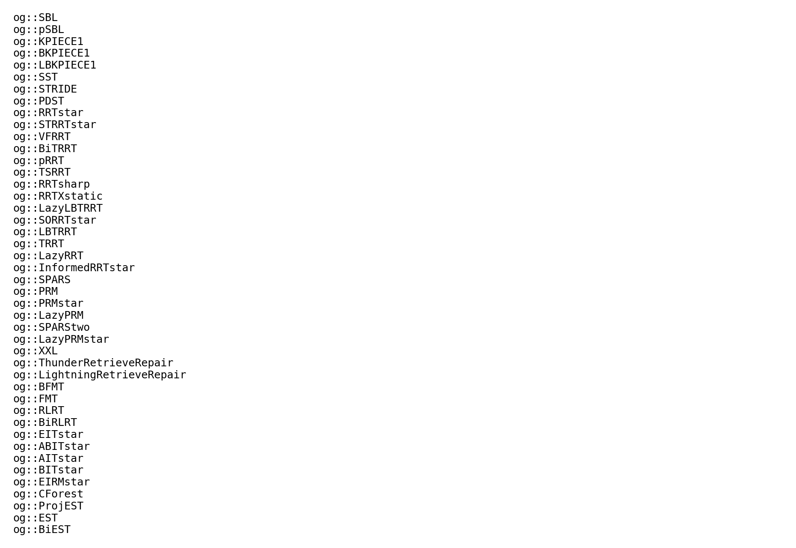
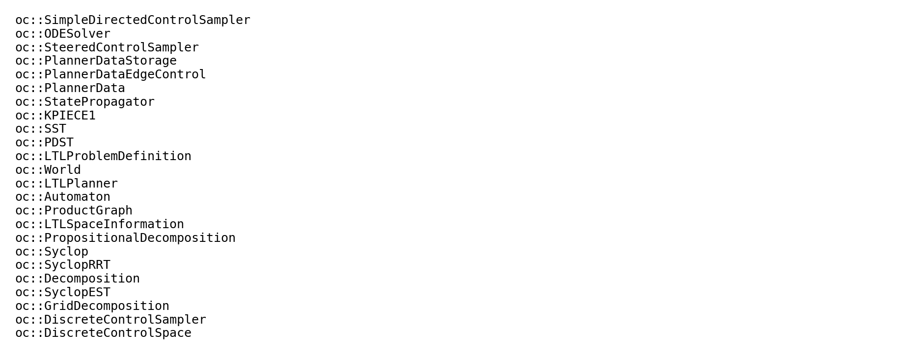
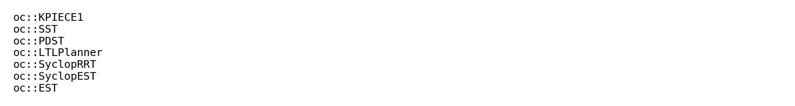

# OMPL Python Bindings

## How to use Python binding

The Python bindings mirror OMPL’s C++ API. For detailed usage, refer to:

- The [C++ OMPL documentation](https://ompl.kavrakilab.org/)  
- The sample scripts in the `pyexamples/` directory  

## How is Nanobind organized?

We use **Nanobind** to generate Python bindings for OMPL. For every OMPL header, there is a corresponding binding file in the `bindings/` directory, organized into subfolders that mirror OMPL’s module structure. For example, all bindings for `ompl::base` live under `bindings/base`.
The [Nanobind documentation](https://nanobind.readthedocs.io/en/latest/) provides a comprehensive guide to writing bindings. The one thing to watch out for is [overriding C++ virtual methods in Python](https://nanobind.readthedocs.io/en/latest/classes.html#overriding-virtual-functions-in-python)—you need a **trampoline class** to forward calls correctly.

## How to contribute to the bindings

### Adding new bindings
The `bindings/` directory mimic the layout of the `src/ompl/` directory. If there is a new header file in `src/ompl/` in the future release, you can add a new binding file in the corresponding subdirectory under `bindings/`. The binding file should have the same name as the header file, with a `.cpp` extension. If you add a new header file `src/ompl/MODULE/SUBFOLERPATH/NEWFEATURE.h`, you should create a binding file `bindings/MODULE/SUBFOLERPATH/NEWFEATURE.cpp`. Here are some examples: 
```
src/ompl/base/StateSpace.h -> bindings/base/StateSpace.cpp
src/ompl/geometric/planners/rrt/RRT.h -> bindings/geometric/planners/rrt/RRT.cpp
src/ompl/control/spaces/RealVectorControlSpace.h -> bindings/control/spaces/RealVectorControlSpace.cpp
```

Then, in the `bindings/MODULE/SUBFOLERPATH/NEWFEATURE.cpp`, you should include the header file and use Nanobind to create the bindings. Here is a minimal example:

Step 1: In the `bindings/MODULE/SUBFOLERPATH/NEWFEATURE.cpp`, include the necessary headers and namespaces:
```C++
#include <nanobind/nanobind.h>
#include "ompl/MODULE/SUBFOLERPATH/NEWFEATURE.h"
#include "init.h" // or "../init.h", depending on the SUBFOLDERPATH

namespace nb = nanobind;

// Necessary namespaces
// namespace ob = ompl::base;
// namespace og = ompl::geometric;
// namespace oc = ompl::control;

```

Step 2: Continue in the `bindings/MODULE/SUBFOLERPATH/NEWFEATURE.cpp`, define the binding function. The function name should follow the pattern `void ompl::binding::MODEULE::initSUBFOLERPATH_NEWFEATURE(nb::module_ &m)`. For example: 
```C++
// In bindings/base/StateSpace.cpp:
void ompl::binding::base::init_StateSpace(nb::module_& m){...}

// In bindings/geometric/planners/rrt/RRT.cpp:
void ompl::binding::geometric::initPlannersRrt_RRT(nb::module_ &m){...}

// In bindings/control/spaces/RealVectorControlSpace.cpp:
void ompl::binding::control::initSpaces_RealVectorControlSpace(nb::module_ &m){...}

```
Step 3: Continue in the `bindings/MODULE/SUBFOLERPATH/NEWFEATURE.cpp`, implement the binding functions. 

Step 4: In the `bindings/MODULE/init.h`, register the new binding function. Then, in `bindings/python.cpp` include the binding function. If the `MODULE` is `base`, leave the function under `nb::module_ base = m.def_submodule("base");`. **Notice that the nanobind compile function in sequencial order,** so if you new binding function depends on other binding functions, make sure to include your new binding function after the dependent binding functions. Otherwise you will get the example error `Critical nanobind error: nanobind::detail::nb_type_new("EIRMstar"): base type "ompl::geometric::EITstar" not known to nanobind!`. 

### Note on ARM platforms

Generating bindings on ARM platforms (e.g., Apple M-series) can sometimes fail due to compiler/linker incompatibilities. To work around this:

- Use **`gcc`** when building the OMPL bindings.  
- If you run into Boost-related linker errors, download and build Boost from source with **`gcc`** as well.  

### Binding Statistics

In this Beta release, some binding components are still unimplemented or untested and are marked with `TODO` comments following this standard convention:

```C++
// TODO [<SCOPE>][<CATEGORY>][<OPTIONAL_SUBTAG>]
//
// <SCOPE>:
//   ClassName   // class name
//
// <CATEGORY>:
//   IMPLEMENT    // feature not yet implemented
//   TEST         // missing tests
//   TRAMPOLINE   // virtual function needing a Python trampoline
//   MISSING      // (class-only) functions that must be added
//
// <OPTIONAL_SUBTAG>:
//   For MISSING:    <missingFunctionName>[, <anotherName>]
//
// Examples:
// TODO [ob::StateSpace][MISSING]["ParamSet & params ()", "void clearStateSamplerAllocator ()"]
// TODO [ob::Planner][TRAMPOLINE]
// TODO [ob::OwenStateSpace][IMPLEMENT]
// TODO [oc::SST][TEST]

```

<!-- Since the Python bindings are still under development and OMPL exposes a vast API, we may have overlooked some object-ownership details. If you encounter a double-free error when using the bindings, please investigate the ownership annotations. Nanobind provides comprehensive guides on [object ownership](https://nanobind.readthedocs.io/en/latest/ownership.html) and [advanced usage](https://nanobind.readthedocs.io/en/latest/ownership_adv.html#enable-shared-from-this). In most cases, applying the `rv_policy::reference_internal` return-value policy to your binding will resolve this issue. -->

Below is an overview of our current nanobind coverage, followed by detailed “to-do” and “done” lists for each module. Run
```bash
python bindings/stats.py
```
to generate the latest statistics.

---

#### Overall Coverage  
  
_Figure: Percentage of classes bound vs. total across all modules._

---

## Base Module

- **Pending bindings**  
    
  _Classes in `base` still marked TODO[IMPLEMENT]_

---

## Geometric Module

- **All class-level TODOs**  
    
  _Classes in `geometric` still marked TODO[IMPLEMENT]_

- **Implemented planners**  
    
  _Planner classes already bound_

- **Planners to implement**  
    
  _Planner classes still pending_

---

## Control Module

- **Pending bindings**  
    
  _Classes in `control` still marked TODO[IMPLEMENT]_

- **Implemented planners**  
    
  _Planner classes already bound_

- **Planners to implement**  
    
  _Planner classes still pending_