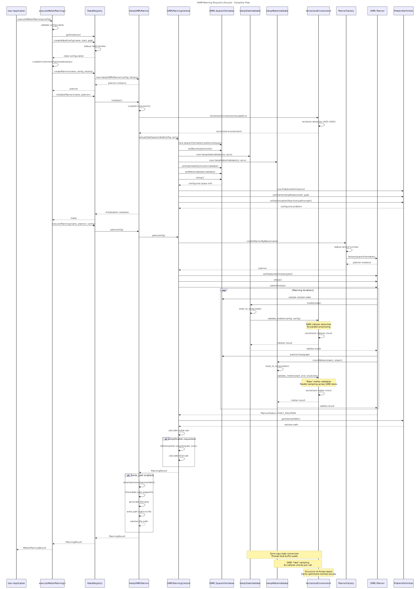

# VAMP-OMPL Motion Planning Package - Architecture Documentation

This document provides architectural documentation for the VAMP-OMPL (Vectorized Accelerated Motion Planning with OMPL) package, which integrates high-performance SIMD collision detection with OMPL's motion planning algorithms.

> ** Architecture Diagrams**: comprehensive visual diagrams are available in [`docs/diagrams/`](docs/diagrams/)

> ** Documentation**: Detailed documentation including ADRs, API reference, and contributor guides available in [`docs/`](docs/)

## Table of Contents

1. [Architecture Overview](#architecture-overview)
2. [Performance Architecture](#performance-architecture)
3. [Class Architecture](#class-architecture)
4. [Planning Workflow](#planning-workflow)
5. [Design Patterns](#design-patterns)
6. [Extension Points](#extension-points)
7. [Documentation Reference](#documentation-reference)
8. [Getting Started](#getting-started)
9. [Contributing](#contributing)

---

## Architecture Overview

### System Layers

**System Architecture Overview**: 

*Source: [`docs/diagrams/01-system-architecture-overview.mmd`](docs/diagrams/01-system-architecture-overview.mmd)*

The VAMP architecture consists of multiple layers:

1. **User Application Layer**: YAML configuration and programmatic APIs
2. **Unified Interface Layer**: Registry-based execution with `executeMotionPlanning()`
3. **Planning Facade Layer**: Main coordination components implementing design patterns
4. **OMPL Integration Layer**: Standard OMPL interfaces with VAMP bridges
5. **VAMP Performance Core**: SIMD-optimized collision detection and vectorization
6. **Robot Type System**: Built-in and extensible robot implementations
7. **Benchmarking System**: OMPL-compliant performance measurement infrastructure

### Key Components

#### 1. **VampOMPLPlanner** (Facade Pattern)
- **Purpose**: Main entry point that coordinates between VAMP and OMPL systems
- **Key Features**: 
  - Dependency injection for robot configuration and environment factory
  - Two-phase initialization (constructor + initialize())
  - Unified planning interface supporting both default and custom configurations
  - Automatic path writing and visualization integration

#### 2. **VampStateValidator & VampMotionValidator** (SIMD-Accelerated)
- **Purpose**: Bridge OMPL's validation interface with VAMP's vectorized collision detection
- **Performance Features**:
  - SIMD vectorization: Process 8 configurations simultaneously  
  - "Rake" motion validation: Spatially distributed parallel sampling
  - Function-local static buffer pools: Allocation-free hot paths
  - Zero-copy OMPL-to-VAMP configuration conversion

#### 3. **RobotRegistry** (Singleton + Registry Pattern)
- **Purpose**: Type-erased robot management with compile-time safety
- **Features**:
  - Automatic registration of built-in robots (Panda, UR5, Fetch)
  - Runtime robot creation from string identifiers
  - Thread-safe robot handler management
  - Extensible to custom robots without core modifications

---

## Performance Architecture

### SIMD Vectorization Pipeline

**SIMD Performance Architecture**: 

*Source: [`docs/diagrams/04-simd-performance-architecture.mmd`](docs/diagrams/04-simd-performance-architecture.mmd)*

### Performance Optimizations

#### 1. **SIMD Vectorization**
- **8x Parallel Processing**: Process 8 robot configurations simultaneously using SIMD instructions
- **Structure-of-Arrays (SOA)**: Memory layout optimized for vectorized operations
- **Cache Efficiency**: Spatial locality in collision geometry access

#### 2. **"Rake" Motion Validation**
- **Parallel Sampling**: Distribute temporal samples across SIMD lanes
- **Resolution Control**: Configurable sampling density per robot type
- **Efficient Pipeline**: Better CPU instruction pipeline utilization

#### 3. **Memory Management**
- **Function-local Static Buffers**: Avoid allocations in collision checking hot path
- **Zero-copy Conversion**: Direct OMPL-to-VAMP configuration mapping
- **SIMD-aligned Memory**: Proper alignment for vectorized operations

---

## Class Architecture

### Design Patterns & Relationships

**Class Architecture & Design Patterns**: 

*Source: [`docs/diagrams/02-class-architecture-patterns.mmd`](docs/diagrams/02-class-architecture-patterns.mmd)*

The class architecture demonstrates sophisticated use of design patterns:

- **OMPL Foundation**: Standard interfaces (`StateValidityChecker`, `MotionValidator`, `Planner`)
- **VAMP Integration**: Template-based bridges with SIMD acceleration
- **Configuration System**: Hierarchical robot and environment configuration
- **Registry System**: Type-erased management with compile-time safety
- **Factory System**: Runtime creation with extensibility
- **Template Relationships**: Type-safe robot-specific implementations

---

## Planning Workflow

### Request Lifecycle

**Planning Request Sequence**: 

*Source: [`docs/diagrams/03-planning-request-sequence.mmd`](docs/diagrams/03-planning-request-sequence.mmd)*

The planning workflow follows a well-defined sequence:

1. **Configuration Phase**: Validation, registry lookup, planner creation
2. **Initialization Phase**: Environment setup, OMPL configuration, validator setup
3. **Planning Execution**: Planner creation, main planning loop with SIMD collision detection
4. **Solution Processing**: Path simplification, result formatting, optional file writing

**Key Performance Points**:
- Zero-copy state conversion using function-local static buffers
- SIMD "rake" sampling for motion validation (8x parallel collision checks)
- Structure-of-Arrays memory layout for cache optimization

---

## Extension Points

### Adding Custom Robots

The extension points are clearly documented in the system architecture diagram above. Key extension areas include:

#### 1. **Custom Robot Implementation**

```cpp
// Example: Define a custom robot
namespace vamp::robots {
    struct MyCustomRobot {
        static constexpr auto name = "my_robot";
        static constexpr auto dimension = 7;      // Number of joints
        static constexpr auto n_spheres = 12;     // Collision spheres
        static constexpr auto resolution = 32;    // Motion validation resolution
        
        // Joint limits
        static constexpr std::array<float, dimension> s_a = {/* lower limits */};
        static constexpr std::array<float, dimension> s_m = {/* ranges */};
        
        // Vectorized forward kinematics + collision checking
        template <std::size_t rake>
        inline static auto fkcc(
            const collision::Environment<FloatVector<rake>> &environment,
            const ConfigurationBlock<rake> &q) noexcept -> bool
        {
            // Implement vectorized forward kinematics
            // Return true if collision-free, false otherwise
        }
        
        // Configuration scaling methods
        inline static void scale_configuration(Configuration &q) noexcept;
        inline static void descale_configuration(Configuration &q) noexcept;
    };
}

// Register the robot
REGISTER_VAMP_ROBOT(vamp::robots::MyCustomRobot, "my_robot");
```

#### 2. **Custom Planner Registration**

```cpp
// Register a custom OMPL planner
OMPLPlanningContext<Robot>::registerPlanner("MyPlanner", 
    [](const ob::SpaceInformationPtr& si) {
        auto planner = std::make_shared<MyCustomPlanner>(si);
        // Set planner-specific parameters
        return planner;
    });
```

---

## Design Patterns

### Core Patterns Used

#### 1. **Facade Pattern** (`VampOMPLPlanner`)
- **Purpose**: Provides a unified interface hiding complexity of VAMP-OMPL integration
- **Benefits**: Single point of entry, simplified client code, decoupled subsystems

#### 2. **Adapter Pattern** (`OMPLPlanningContext`)
- **Purpose**: Bridges OMPL's interface with VAMP's collision detection system
- **Benefits**: Maintains compatibility, clean separation of concerns

#### 3. **Factory Pattern** (`PlannerFactory`, `RobotRegistry`)
- **Purpose**: Runtime creation of planners and robots from string identifiers
- **Benefits**: Open/Closed Principle compliance, extensibility without modification

#### 4. **Registry Pattern** (`RobotRegistry`)
- **Purpose**: Type-erased management of different robot types
- **Benefits**: Runtime polymorphism with compile-time safety

#### 5. **Template Method Pattern** (Planning workflow)
- **Purpose**: Standardizes planning algorithm while allowing customization
- **Benefits**: Consistent interface, flexible implementation

---

## Documentation Reference

### Complete Documentation Suite

The VAMP package includes comprehensive documentation for different audiences:

#### **Architecture Decision Records (ADRs)**
- [`ADR-001: SIMD Vectorization Strategy`](docs/ADR-001-SIMD-Vectorization-Strategy.md) - Performance optimization decisions
- [`ADR-002: Registry Pattern Architecture`](docs/ADR-002-Registry-Pattern-Architecture.md) - Type management system design
- [`ADR-003: Two-Phase Initialization Pattern`](docs/ADR-003-Two-Phase-Initialization-Pattern.md) - Initialization strategy rationale

#### **API Documentation**
- [`API Reference Guide`](docs/API-Reference.md) - Comprehensive API documentation with examples
- Public interfaces, extension points, and usage patterns
- Performance guidelines and best practices

#### **Contributor Resources**
- [`Contributor Guide`](docs/CONTRIBUTOR-GUIDE.md) - Complete guide for developers
- Design principles, coding standards, and extension patterns
- Testing guidelines and performance optimization strategies

#### **Architecture Diagrams**
- [`docs/diagrams/`](docs/diagrams/) - Four comprehensive visual diagrams
- System overview, class relationships, sequence flows, SIMD architecture
- [`docs/diagrams/README.md`](docs/diagrams/README.md) - Diagram documentation and usage guide

#### **Analysis & Summary**
- [`Architecture Analysis Summary`](docs/ARCHITECTURE-ANALYSIS-SUMMARY.md) - analysis
- Strengths, performance characteristics, and future considerations

### Documentation Generation

Generate visual diagrams from source:
```bash
cd docs/
python3 generate_diagrams.py
```

---

## Getting Started

### Quick Start

For basic usage examples, see the main [README.md](README.md#configuration-examples).

For detailed API usage, see [docs/API-Reference.md](docs/API-Reference.md).

---

## Contributing

### Quick Start for Contributors

1. **Read the Contributor Guide**: [`docs/CONTRIBUTOR-GUIDE.md`](docs/CONTRIBUTOR-GUIDE.md) - Complete development guide
2. **Review ADRs**: Understand architectural decisions in [`docs/`](docs/)
3. **Study Examples**: See `CustomRobotExample.h` and demo applications
4. **Follow Patterns**: Use established design patterns (Facade, Registry, Factory, etc.)

### Extension Guidelines

1. **Robot Extensions**: Implement VAMP robot interface, use `REGISTER_VAMP_ROBOT` macro
2. **Planner Extensions**: Inherit from OMPL planners, register with `PlannerFactory`
3. **Environment Extensions**: Implement `EnvironmentFactory` interface
4. **Performance**: Maintain SIMD-friendly data structures and vectorized algorithms

### Code Quality Standards

- **Design Patterns**: Follow established patterns (see [`docs/CONTRIBUTOR-GUIDE.md`](docs/CONTRIBUTOR-GUIDE.md))
- **Type Safety**: Use templates for compile-time validation, `std::any` for runtime flexibility
- **RAII**: All resources managed with RAII principles
- **Error Handling**: Use `VampConfigurationError` hierarchy with actionable messages
- **Documentation**: Comprehensive inline documentation for all public APIs

---

## File Organization

```
demos/Vamp/
├── ARCHITECTURE.md                    # This file - Architecture overview
├── README.md                          # User guide and examples
│
├── core/                             # Core implementation files
│   ├── VampOMPLPlanner.h             # Main facade interface
│   ├── OMPLPlanningContext.h         # OMPL adapter layer
│   ├── VampValidators.h              # SIMD-accelerated validators
│   ├── VampOMPLInterfaces.h          # Core data structures
│   ├── VampOMPLDemo.h                # Demo application interface
│   └── OMPLPlannerRegistry.h         # Planner registration system
│
├── docs/                             #  Complete Documentation Suite
│   ├── ADR-001-SIMD-Vectorization-Strategy.md
│   ├── ADR-002-Registry-Pattern-Architecture.md
│   ├── ADR-003-Two-Phase-Initialization-Pattern.md
│   ├── API-Reference.md              # Comprehensive API documentation
│   ├── CONTRIBUTOR-GUIDE.md          # Complete contributor guide
│   ├── ARCHITECTURE-ANALYSIS-SUMMARY.md # Executive architectural analysis
│   ├── generate_diagrams.py          # Diagram generation script
│   └── diagrams/                     #  Visual Architecture Diagrams
│       ├── README.md                 # Diagram documentation
│       ├── 01-system-architecture-overview.mmd
│       ├── 02-class-architecture-patterns.mmd
│       ├── 03-planning-request-sequence.mmd
│       └── 04-simd-performance-architecture.mmd
│       ├── 01-system-architecture-overview.svg
│       ├── 02-class-architecture-patterns.svg
│       ├── 03-planning-request-sequence.svg
│       └── 04-simd-performance-architecture.svg
│
├── core/                             # Core implementation files
├── utilities/                        # Utility components
│   ├── VampUtils.h                   # Configuration and utility functions
│   └── VampRobotRegistry.h           # Robot registration system
├── examples/                         # Example implementations
├── demos/                           # Demo applications
├── benchmarking/                    # Performance measurement
├── config/                          # YAML configuration files
└── visualization/                   # Python visualization tools
```

---

## Performance Notes

**Measured Performance Improvements:**
- **8x collision detection speedup** through SIMD vectorization
- **Zero-allocation hot paths** through function-local static buffer pools
- **Cache-optimized memory access** via Structure-of-Arrays layout

**Performance Dependencies:**
- Robot complexity (joint count, collision spheres)
- Environment density (obstacle count and distribution)
- Hardware SIMD capabilities (AVX2 support)
- Motion validation resolution (configurable per robot type)

---

## Additional Resources

- **OMPL Documentation**: [https://ompl.kavrakilab.org/](https://ompl.kavrakilab.org/)
- **Contributing**: See [`docs/CONTRIBUTOR-GUIDE.md`](docs/CONTRIBUTOR-GUIDE.md) for detailed guidelines
- **Architecture Decisions**: Review ADRs in [`docs/`](docs/) for design rationale

*For implementation details, see the individual header files and comprehensive documentation in [`docs/`](docs/).*
