# VAMP Motion Planning Package - Architecture Documentation

This document provides comprehensive architectural documentation for the VAMP (Vectorized Automatic Motion Planner) package, which integrates high-performance SIMD collision detection with OMPL's motion planning algorithms.

> ** Architecture Diagrams**: Visual diagrams are available in [`docs/diagrams/`](docs/diagrams/).

## Table of Contents

1. [Architecture Overview](#architecture-overview)
2. [Performance Architecture](#performance-architecture)
3. [Extension Points](#extension-points)
4. [Design Patterns](#design-patterns)
5. [Getting Started](#getting-started)
6. [Contributing](#contributing)

---

## Architecture Overview

### System Layers

**Architecture Overview Diagram**: 

*Source: [`docs/diagrams/architecture-overview.mmd`](docs/diagrams/architecture-overview.mmd)*

### Key Components

#### 1. **VampOMPLPlanner** (Facade Pattern)
- **Purpose**: Main entry point that coordinates between VAMP and OMPL systems
- **Key Features**: 
  - Dependency injection for robot configuration and environment factory
  - Two-phase initialization (constructor + initialize())
  - Unified planning interface supporting both default and custom configurations
  - Automatic path writing and visualization integration

#### 2. **VampStateValidator & VampMotionValidator** (SIMD-Accelerated)
- **Purpose**: Bridge OMPL's validation interface with VAMP's vectorized collision detection
- **Performance Features**:
  - SIMD vectorization: Process 8 configurations simultaneously  
  - "Rake" motion validation: Spatially distributed parallel sampling
  - Thread-local buffer pools: Allocation-free hot paths
  - Zero-copy OMPL-to-VAMP configuration conversion

#### 3. **RobotRegistry** (Singleton + Registry Pattern)
- **Purpose**: Type-erased robot management with compile-time safety
- **Features**:
  - Automatic registration of built-in robots (Panda, UR5, Fetch)
  - Runtime robot creation from string identifiers
  - Thread-safe robot handler management
  - Extensible to custom robots without core modifications

---

## Performance Architecture

### SIMD Vectorization Pipeline

**Performance & Data Flow Diagram**: 

*Source: [`docs/diagrams/performance-dataflow.mmd`](docs/diagrams/performance-dataflow.mmd)*

### Performance Optimizations

#### 1. **SIMD Vectorization**
- **8x Parallel Processing**: Process 8 robot configurations simultaneously using SIMD instructions
- **Structure-of-Arrays (SOA)**: Memory layout optimized for vectorized operations
- **Cache Efficiency**: Spatial locality in collision geometry access

#### 2. **"Rake" Motion Validation**
- **Parallel Sampling**: Distribute temporal samples across SIMD lanes
- **Resolution Control**: Configurable sampling density per robot type
- **Efficient Pipeline**: Better CPU instruction pipeline utilization

#### 3. **Memory Management**
- **Thread-local Buffers**: Avoid allocations in collision checking hot path
- **Zero-copy Conversion**: Direct OMPL-to-VAMP configuration mapping
- **SIMD-aligned Memory**: Proper alignment for vectorized operations

---

## Extension Points

### Adding Custom Robots

**Extension Points & Patterns Diagram**: 

*Source: [`docs/diagrams/extension-patterns.mmd`](docs/diagrams/extension-patterns.mmd)*

#### 1. **Custom Robot Implementation**

```cpp
// Example: Define a custom robot
namespace vamp::robots {
    struct MyCustomRobot {
        static constexpr auto name = "my_robot";
        static constexpr auto dimension = 7;      // Number of joints
        static constexpr auto n_spheres = 12;     // Collision spheres
        static constexpr auto resolution = 32;    // Motion validation resolution
        
        // Joint limits
        static constexpr std::array<float, dimension> s_a = {/* lower limits */};
        static constexpr std::array<float, dimension> s_m = {/* ranges */};
        
        // Vectorized forward kinematics + collision checking
        template <std::size_t rake>
        inline static auto fkcc(
            const collision::Environment<FloatVector<rake>> &environment,
            const ConfigurationBlock<rake> &q) noexcept -> bool
        {
            // Implement vectorized forward kinematics
            // Return true if collision-free, false otherwise
        }
        
        // Configuration scaling methods
        inline static void scale_configuration(Configuration &q) noexcept;
        inline static void descale_configuration(Configuration &q) noexcept;
    };
}

// Register the robot
REGISTER_VAMP_ROBOT(vamp::robots::MyCustomRobot, "my_robot");
```

#### 2. **Custom Planner Registration**

```cpp
// Register a custom OMPL planner
OMPLPlanningContext<Robot>::registerPlanner("MyPlanner", 
    [](const ob::SpaceInformationPtr& si) {
        auto planner = std::make_shared<MyCustomPlanner>(si);
        // Set planner-specific parameters
        return planner;
    });
```

---

## Design Patterns

### Core Patterns Used

#### 1. **Facade Pattern** (`VampOMPLPlanner`)
- **Purpose**: Provides a unified interface hiding complexity of VAMP-OMPL integration
- **Benefits**: Single point of entry, simplified client code, decoupled subsystems

#### 2. **Adapter Pattern** (`OMPLPlanningContext`)
- **Purpose**: Bridges OMPL's interface with VAMP's collision detection system
- **Benefits**: Maintains compatibility, clean separation of concerns

#### 3. **Factory Pattern** (`PlannerFactory`, `RobotRegistry`)
- **Purpose**: Runtime creation of planners and robots from string identifiers
- **Benefits**: Open/Closed Principle compliance, extensibility without modification

#### 4. **Registry Pattern** (`RobotRegistry`)
- **Purpose**: Type-erased management of different robot types
- **Benefits**: Runtime polymorphism with compile-time safety

#### 5. **Template Method Pattern** (Planning workflow)
- **Purpose**: Standardizes planning algorithm while allowing customization
- **Benefits**: Consistent interface, flexible implementation

---

## Getting Started

### Basic Usage

```cpp
#include "VampOMPLDemo.h"
#include "VampRobotRegistry.h"
#include "VampUtils.h"

using namespace vamp_ompl;

// 1. Create planning configuration
PlanningConfiguration config;
config.robot_name = "panda";
config.start_config = {0.0f, 0.0f, 0.0f, 0.0f, 0.0f, 0.0f, 0.0f};
config.goal_config = {1.0f, 1.0f, 1.0f, 1.0f, 1.0f, 1.0f, 1.0f};

// 2. Add obstacles
ObstacleConfig obstacle;
obstacle.type = "sphere";
obstacle.position = {0.5f, 0.5f, 0.5f};
obstacle.radius = constants::DEFAULT_SPHERE_RADIUS;
config.obstacles.push_back(obstacle);

// 3. Configure planner
config.planning.planner_name = "RRT-Connect";
config.planning.planning_time = constants::DEFAULT_PLANNING_TIME;

// 4. Execute planning (uses registry internally)
auto result = executeMotionPlanning(config);

// 5. Process results
VampUtils::printResults(result.planning_result);
```

### YAML Configuration

```yaml
robot:
  name: "panda"
  description: "Franka Emika Panda arm"

planner:
  name: "BIT*"
  planning_time: 5.0
  simplification_time: 1.0

start_config: [0.0, 0.0, 0.0, 0.0, 0.0, 0.0, 0.0]
goal_config: [1.0, 1.0, 1.0, 1.0, 1.0, 1.0, 1.0]

obstacles:
  - type: "sphere"
    position: [0.5, 0.5, 0.5]
    radius: 0.1

output:
  write_path: true
```

---

## Contributing

### Extension Guidelines

1. **Robot Extensions**: See `CustomRobotExample.h` for complete implementation example
2. **Planner Extensions**: Follow OMPL planner interface, register with `PlannerFactory`
4. **Performance**: Maintain SIMD-friendly data structures and algorithms

### Code Style

- **Template-based Design**: Use templates for compile-time polymorphism where possible
- **RAII**: All resources managed with RAII principles
- **Error Handling**: Use `VampConfigurationError` hierarchy for configuration errors
- **Documentation**: Comprehensive inline documentation for all public APIs

---

## File Organization

```
demos/Vamp/
├── ARCHITECTURE.md              # This file
├── README.md                    # User guide and examples
├── VampOMPLPlanner.h           # Main facade interface
├── OMPLPlanningContext.h       # OMPL adapter layer
├── VampValidators.h            # SIMD-accelerated validators
├── VampRobotRegistry.h         # Robot management system
├── VampOMPLInterfaces.h        # Core data structures
├── VampUtils.h                 # Utilities and configuration
├── CustomRobotExample.h        # Extension example
├── VampDemo.cpp               # Basic demo application
├── CustomRobotDemo.cpp        # Custom robot demo
├── config/                    # YAML configuration files
└── visualization/             # Python visualization tools
```

---


**Note**: Actual performance depends on robot complexity, environment density, and hardware SIMD capabilities.

---

*For more details, see the individual header files and the examples in this directory.*
