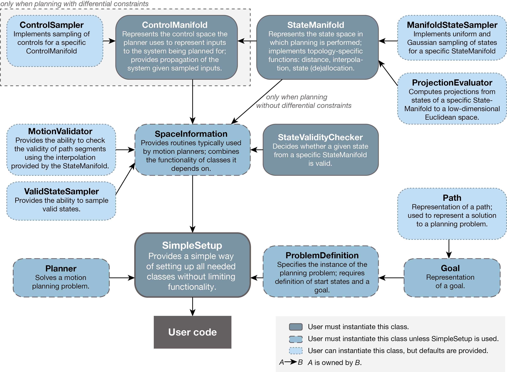

# API Overview

\htmlonly
<map name=APImap>
<area href="classompl_1_1control_1_1ControlSampler.html" alt="ControlSampler" coords="8,19,198,79">
<area href="classompl_1_1control_1_1DirectedControlSampler.html" alt="DirectedControlSampler" coords="8,80,198,140">
<area href="classompl_1_1control_1_1StatePropagator.html" alt="StatePropagator" coords="8,140,198,216">
<area href="classompl_1_1control_1_1ControlSpace.html" alt="ControlSpace" coords="229,22,409,139">
<area href="classompl_1_1base_1_1StateSpace.html" alt="StateSpace" coords="439,24,652,141">
<area href="classompl_1_1base_1_1StateSampler.html" alt="StateSampler" coords="684,25,867,108">
<area href="classompl_1_1base_1_1ProjectionEvaluator.html" alt="ProjectionEvaluator" coords="684,130,867,213">
<area href="classompl_1_1base_1_1MotionValidator.html" alt="MotionValidator" coords="12,241,199,328">
<area href="classompl_1_1base_1_1SpaceInformation.html" alt="SpaceInformation" coords="230,240,432,330">
<area href="classompl_1_1base_1_1StateValidityChecker.html" alt="StateValidityChecker" coords="450,238,652,328">
<area href="classompl_1_1base_1_1ValidStateSampler.html" alt="ValidStateSampler" coords="8,335,204,407">
<area href="classompl_1_1base_1_1Planner.html" alt="Planner" coords="21,440,189,512">
<area href="classompl_1_1geometric_1_1SimpleSetup.html" alt="SimpleSetup" coords="232,399,432,514">
<area href="classompl_1_1base_1_1ProblemDefinition.html" alt="ProblemDefinition" coords="451,418,655,512">
<area href="classompl_1_1base_1_1Goal.html" alt="Goal" coords="690,441,862,512">
<area href="classompl_1_1base_1_1Path.html" alt="Path" coords="680,320,867,417">
</map>

\endhtmlonly

The class ownership diagram above shows the relationship between the essential base classes in OMPL. For example, __SpaceInformation__ owns a __StateSpace__; __Planner__ does _not_ own __SpaceInformation__, although a __Planner__ does know about the __SpaceInformation__, and uses provided functionality. Users are encouraged to use the __SimpleSetup__ class (ompl::geometric::SimpleSetup or ompl::control::SimpleSetup). With this class, it is only necessary to instantiate a ompl::base::StateSpace object, a ompl::control::ControlSpace object (when planning with differential constraints, i.e, planning with controls), and a ompl::base::StateValidityChecker object. Many common state spaces have already been implemented as derived __StateSpace__ classes. See a list [here](availableStateSpaces.html).

The ompl::base::StateValidityChecker is problem-specific, so no default implementation is available. See [this document](stateValidation.html) for more information on state validity checking. For more advanced definitions of goals, see [this document](goalRepresentation.html).

#### Doxygen-generated documentation
- [Namespace List](namespaces.html)
- [Class List](annotated.html)

#### Thread safety
All static, non-member or const member functions are thread safe. Calling member functions that are not const in multiple threads simultaneously is unsafe and locks should be used.

#### Memory management

For all base classes __Class__, a __ClassPtr__ type is defined as well. __ClassPtr__ is in fact a [boost shared pointer](http://wiki.inkscape.org/wiki/index.php/Boost_shared_pointers) for __Class__:
~~~{.cpp}
class Class;
typedef boost::shared_ptr<Class> ClassPtr;
~~~
The code above is generated by the ClassForward macro defined in ompl/util/ClassForward.h:
~~~{.cpp}
ClassForward(Class);
~~~
Often the user is required to operate with \b *Ptr variables, in order to ensure all memory is freed at the termination of the program without explicitly calling \c delete. For some classes internal to the library, a C-style pointer is maintained instead of the \b *Ptr variable to avoid cyclic dependencies (which prevent memory de-allocation).
