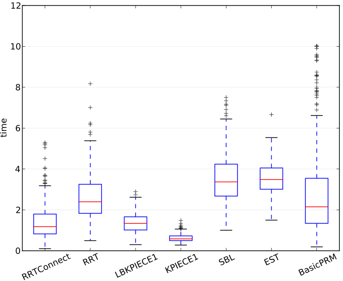
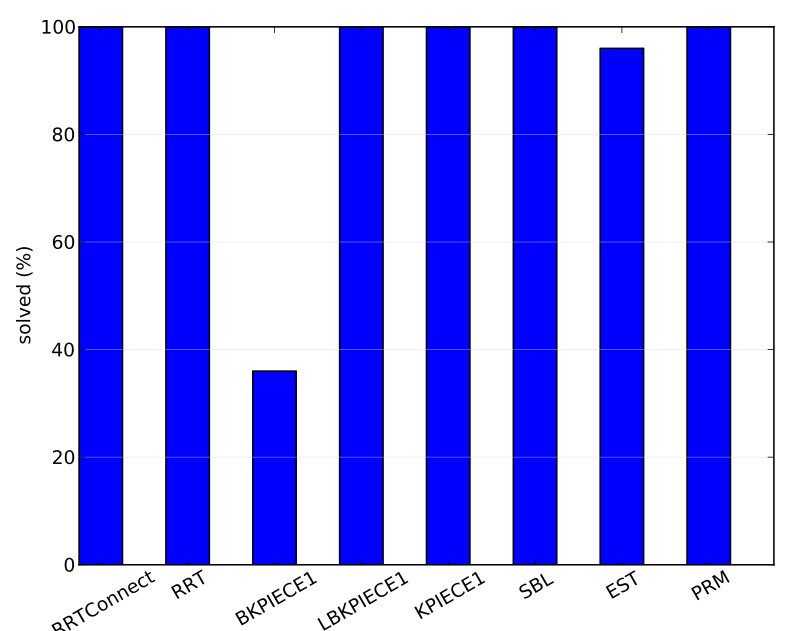

# How to benchmark planners

OMPL contains a ompl::Benchmark class that facilitates solving a motion planning problem repeatedly with different planners, different samplers, or even differently configured versions of the same planning algorithm. Below, we will describe how you can use this class.

- \ref benchmark_code
- \ref benchmark_log
- \ref benchmark_sample_results

For a command line program for rigid body motion planning, see the [ompl_benchmark](http://ompl.kavrakilab.org/benchmark.html) program in OMPL.app. For more advanced benchmarks, please see [plannerarena.org](http://plannerarena.org).

# Writing benchmarking code {#benchmark_code}

Benchmarking a set of planners on a specified problem is a simple task in OMPL. The steps involved are as follows:

- Configure the benchmark problem using ompl::geometric::SimpleSetup or ompl::control::SimpleSetup
- Create a ompl::Benchmark object that takes the problem as input
- Add one or more planners to the benchmark
- Optionally add events to be called before and/or after the execution of a planner
- Run the benchmark problem a specified number of times, subject to specified time and memory limits

The following code snippet shows you how to do this. We will start with some initial code that you have probably already used:

~~~{.cpp}
#include "ompl/tools/benchmark/Benchmark.h"

// A function that matches the ompl::base::PlannerAllocator type.
// It will be used later to allocate an instance of EST
ompl::base::PlannerPtr myConfiguredPlanner(const ompl::base::SpaceInformationPtr &si)
{
    geometric::EST *est = new ompl::geometric::EST(si);
    est->setRange(100.0);
    return ompl::base::PlannerPtr(est);
}

// Create a state space for the space we are planning in
ompl::geometric::SimpleSetup ss(space);

// Configure the problem to solve: set start state(s)
// and goal representation
// Everything must be set up to the point ss.solve()
// can be called. Setting up a planner is not needed.
~~~

Benchmarking code starts here:

~~~{.cpp}
// First we create a benchmark class:
ompl::tools::Benchmark b(ss, "my experiment");

// We add the planners to evaluate.
b.addPlanner(base::PlannerPtr(new geometric::KPIECE1(ss.getSpaceInformation())));
b.addPlanner(base::PlannerPtr(new geometric::RRT(ss.getSpaceInformation())));
b.addPlanner(base::PlannerPtr(new geometric::SBL(ss.getSpaceInformation())));
b.addPlanner(base::PlannerPtr(new geometric::LBKPIECE1(ss.getSpaceInformation())));
// etc

// For planners that we want to configure in specific ways,
// the ompl::base::PlannerAllocator should be used:
b.addPlannerAllocator(boost::bind(&myConfiguredPlanner, _1));
// etc.

// Now we can benchmark: 5 second time limit for each plan computation,
// 100 MB maximum memory usage per plan computation, 50 runs for each planner
// and true means that a text-mode progress bar should be displayed while
// computation is running.
ompl::tools::Benchmark::Request req;
req.maxTime = 5.0;
req.maxMem = 100.0;
req.runCount = 50;
req.displayProgress = true;
b.benchmark(req);

// This will generate a file of the form ompl_host_time.log
b.saveResultsToFile();
~~~

Adding callbacks for before and after the execution of a run is also possible:

~~~{.cpp}
// Assume these functions are defined
void optionalPreRunEvent(const base::PlannerPtr &planner)
{
    // do whatever configuration we want to the planner,
    // including changing of problem definition (input states)
    // via planner->getProblemDefinition()
}

void optionalPostRunEvent(const base::PlannerPtr &planner, tools::Benchmark::RunProperties &run)
{
    // do any cleanup, or set values for upcoming run (or upcoming call to the pre-run event).

    // adding elements to the set of collected run properties is also possible;
    // (the added data will be recorded in the log file)

    run["some extra property name INTEGER"] = "some value";
    // The format of added data is string key, string value pairs,
    // with the convention that the last word in string key is one of
    // REAL, INTEGER, BOOLEAN, STRING. (this will be the type of the field
    // when the log file is processed and saved as a database).
    // The values are always converted to string.
}

// After the Benchmark class is defined, the events can be optionally registered:
b.setPreRunEvent(boost::bind(&optionalPreRunEvent, _1));
b.setPostRunEvent(boost::bind(&optionalPostRunEvent, _1, _2));
~~~

# Processing the benchmarking log file {#benchmark_log}

Once the C++ code computing the results has been executed, a log file is generated. This contains information
about the settings of the planners, the parameters of the problem tested on, etc. To visualize this
information, we provide a script that parses the log files:

    ompl/scripts/benchmark_statistics.py logfile.log -d mydatabase.db

This will generate a SQLite database containing the parsed data. If no database name is specified, the named is assumed to be benchmark.db Once this database is generated, we can construct plots:

    ompl/scripts/benchmark_statistics.py -d mydatabase.db -p boxplot.pdf

This will generate a series of plots, one for each of the attributes described below, showing the results for each planner. [Below](#benchmark_sample_results) we have included some sample benchmark results.

If you would like to process the data in different ways, you can generate a dump file that you can load in a MySQL database:

    ompl/scripts/benchmark_statistics.py -d mydatabase.db -m mydump.sql

The database will contain 2 + _k_ tables:

- _planners_ is a table that contains planner configurations
- _experiments_ is a table that contains details about conducted experiments
- _k_ tables named \e planner_<name>, one for each planner, containing measurements

For more details on how to use the benchmark script, see:

    scripts/benchmark_statistics.py --help

Collected benchmark data for each experiment:

- __name:__ name of experiment (optional)
- __totaltime:__ the total duration for conducting the experiment (seconds)
- __timelimit:__ the maximum time allowed for every planner execution (seconds)
- __memorylimit:__ the maximum memory allowed for every planner execution (MB)
- __hostname:__ the name of the host on which the experiment was run
- __date:__ the date and time when the experiment was started

Collected benchmark data for each planner execution:

- __time:__ (real) the amount of time spent planning, in seconds
- __memory:__ (real) the amount of memory spent planning, in MB. Note: this may be inaccurate since memory is often freed in a lazy fashion
- __solved:__ (boolean) flag indicating whether the planner found a solution. Note: the solution can be approximate
- __approximate solution:__ (boolean) flag indicating whether the found solution is approximate (does not reach the goal, but moves towards it)
- __solution difference:__ (real) if the solution is approximate, this is the distance from the end-point of the found approximate solution to the actual goal
- __solution length:__ (real) the length of the found solution
- __solution smoothness:__ (real) the smoothness of the found solution (the closer to 0, the smoother the path is)
- __solution clearance:__ (real) the clearance of the found solution (the higher the value, the larger the distance to invalid regions)
- __solution segments:__ (integer) the number of segments on the solution path
- __correct solution:__ (boolean) flag indicating whether the found solution is correct (a separate check is conducted). This should always be true.
- __correct solution strict:__ (boolean) flag indicating whether the found solution is correct when checked at a finer resolution than the planner used when validating motion segments. If this is sometimes false it means that the used state validation resolution is too high (only applies when using ompl::base::DiscreteMotionValidator).
- __simplification time:__ (real) the time spend simplifying the solution path, in seconds
- __simplified solution length:__ (real) the length of the found solution after simplification
- __simplified solution smoothness:__ (real) the smoothness of the found solution after simplification (the closer to 0, the smoother the path is)
- __simplified solution clearance:__ (real) the clearance of the found solution after simplification (the higher the value, the larger the distance to invalid regions)
- __simplified solution segments:__ (integer) the number of segments on solution path after simplification
- __simplified correct solution:__ (boolean) flag indicating whether the found solution is correct after simplification. This should always be true.
- __simplified correct solution strict:__ (boolean) flag indicating whether the found solution is correct after simplification, when checked at a finer resolution.
- __graph states:__ (integer) the number of states in the constructed graph
- __graph motions:__ (integer) the number of edges (motions) in the constructed graph
- __valid segment fraction:__ (real) the fraction of segments that turned out to be valid (using ompl::base::MotionValidator) out of all the segments that were checked for validity
- more planner-specific properties

# Sample benchmark results {#benchmark_sample_results}

Below are sample results for running benchmarks for two example problems: the “cubicles” environment and the “Twistycool” environment. The complete benchmarking program (SE3RigidBodyPlanningBenchmark.cpp), the environment and robot files are included with OMPL.app, so you can rerun the exact same benchmarks on your own machine. See the [gallery](gallery.html#gallery_omplapp) for visualizations of sample solutions to both problems. The results below were run on a recent model Apple MacBook Pro (2.66 GHz Intel Core i7, 8GB of RAM). It is important to note that none of the planner parameters were tuned; all benchmarks were run with default settings. From these results one cannot draw any firm conclusions about which planner is “better” than some other planner.

These are the PDF files with plots as generated by the benchmark_statistics.py script:

- [The “cubicles” problem with default settings](../images/cubicles.pdf)
- [The “Twistycool” problem with default settings](../images/Twistycool.pdf)

The plots show comparisons between ompl::geometric::RRTConnect, ompl::geometric::RRT, ompl::geometric::BKPIECE1, ompl::geometric::LBKPIECE1, ompl::geometric::KPIECE1, ompl::geometric::SBL, ompl::geometric::EST, and ompl::geometric::PRM. Each planner is run 500 times with a 10 second time limit for the cubicles problem for each sampling strategy, while for the Twistycool problem each planner is run 50 times with a 60 second time limit.

For integer and real-valued measurements the script will compute [box plots](http://en.wikipedia.org/wiki/Box_plot). For example, here is the plot for the real-valued attribute __time__ for the cubicles environment:

For boolean measurements the script will create bar charts with the percentage of __true__ values. For example, here is the plot for the boolean attribute __solved__ for the Twistycool environment, a much harder problem:

Whenever measurements are not always available for a particular attribute, the columns for each planner are labeled with the number of runs for which no data was available. For instance, the boolean attribute __correct solution__ is not set if a solution is not found.
