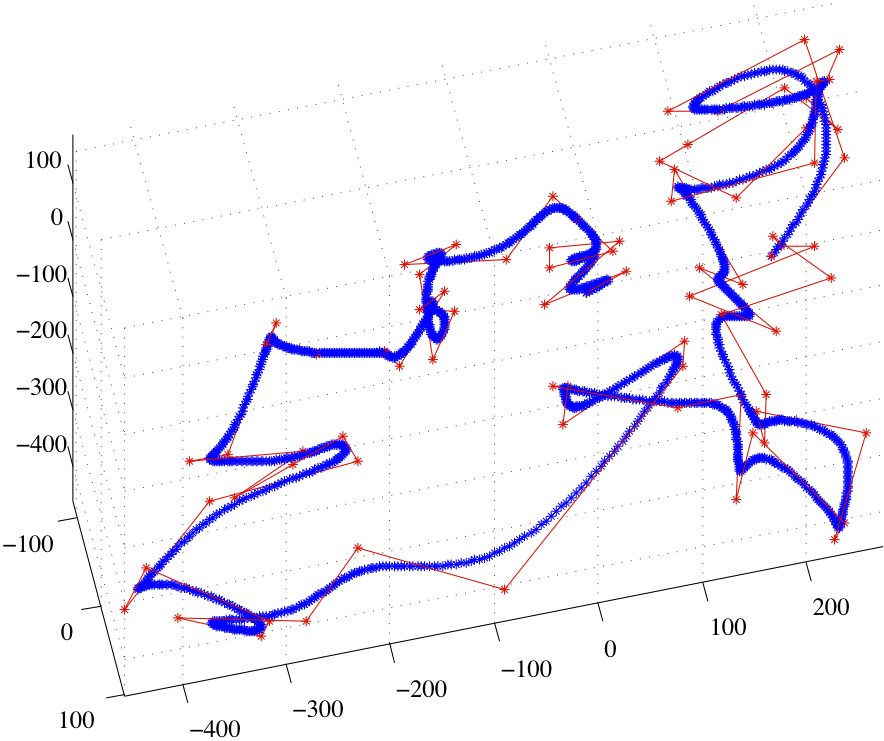

# Gallery

# Manipulation Planning

An example of using OMPL on the PR2 from [Willow Garage](http://www.willowgarage.com). The robot is asked to move the manipulate objects on the table. This demo is using the [OMPL ROS package](http://www.ros.org/wiki/ompl).

\htmlonly
<iframe width="560" height="315" src="http://www.youtube.com/embed/eUpvbOxrbwY" frameborder="0" allowfullscreen></iframe>
\endhtmlonly

# ROS-Industrial Consortium

ROS-Industrial aims to bring ROS to the industrial world. Path and motion planning, as provided by OMPL, are critical component of that. Below is brief overview of ROS-Industrial.

\htmlonly
<iframe width="560" height="315" src="http://www.youtube.com/embed/h54YzGIZFt4" frameborder="0" allowfullscreen></iframe>
\endhtmlonly

# Real-time footstep planning for humanoid robots

Below is a video illustrating the results of using OMPL to plan footsteps for a humanoid. The work is described in detail in:

  Nicolas Perrin and Olivier Stasse and Florent Lamiraux and Young J. Kim and Dinesh Manocha, Real-time footstep planning for humanoid robots among 3D obstacles using a hybrid bounding box, in _Proc. IEEE Conf. on Robotics and Automation_, 2012.

The focus is not so much on OMPL, but rather a new hybrid bounding box that allows the robot to step over obstacles.

\htmlonly
<iframe width="420" height="315" src="http://www.youtube.com/embed/HNE4dMycosE" frameborder="0" allowfullscreen></iframe>
\endhtmlonly

# Planning for a Car-Like Vehicle Using ODE

An example of using OMPL to plan for a robotic system simulated with [ODE](http://sourceforge.net/projects/opende). The goal is for the yellow car to reach the location of the green box without hitting the red box. The computation is performed using \ref cKPIECE1 "KPIECE". For each computed motion plan, a representation of the exploration data structure (a tree of motions) is also shown.

\htmlonly
<iframe width="420" height="315" src="http://www.youtube.com/embed/bX23YA-pasg" frameborder="0" allowfullscreen></iframe>
\endhtmlonly

# Planning for Rigid Bodies Using OMPL.app {#gallery_omplapp}

Below are some rigid body motion planning problems and corresponding solutions found by OMPL.app.

__The “cubicles” environment.__ An L-shaped robot has to fly through a number of rooms and the “basement” to reach the goal state:

\htmlonly

  

  

\endhtmlonly

__The “Twistycool” environment.__ A twisted shape has to make a complex maneuver to move through a narrow passage:

\htmlonly

  

  

\endhtmlonly

# Class Project from COMP 450 on Path Optimization {#gallery_comp450}

In Fall 2010 OMPL was used for the first time in Lydia Kavraki's Algorithmic Robotics class. Students completed several projects. For their last project they could choose from several options. Linda Hill and Yu Yun worked on path optimization. The different optimization criteria considered they considered were path length and sum of discrete path curvature sum. Minimizing the former in shorter paths, minimizing the second results in smoother paths. They used two optimization techniques specific to paths / curves: B-spline interpolation and path hybridization. Path smoothing using B-spline interpolation is shown below on the left. In path hybridization a set of (approximate) solutions to a motion planning problem is given as input, cross-over points are computed, and a new optimized path composed of path segments is found. An example of path hybridization to minimize path length is shown below on the right. In both cases the paths were in SE(3); the figures show simply the R3 component.

\htmlonly

   
<b>Path smoothing with B-splines.</b> The input path is shown in red, the optimized output path is shown in blue.

   
<b>Path shortening using path hybridization.</b> The colored paths are input, the solid black path is the optimized output path.

\endhtmlonly
