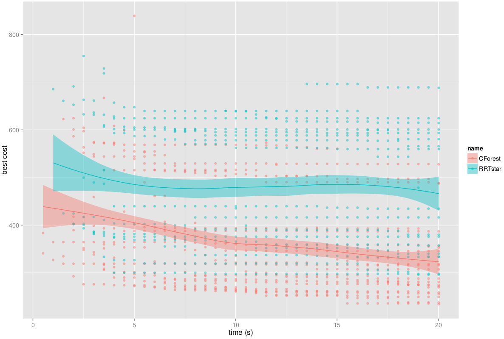
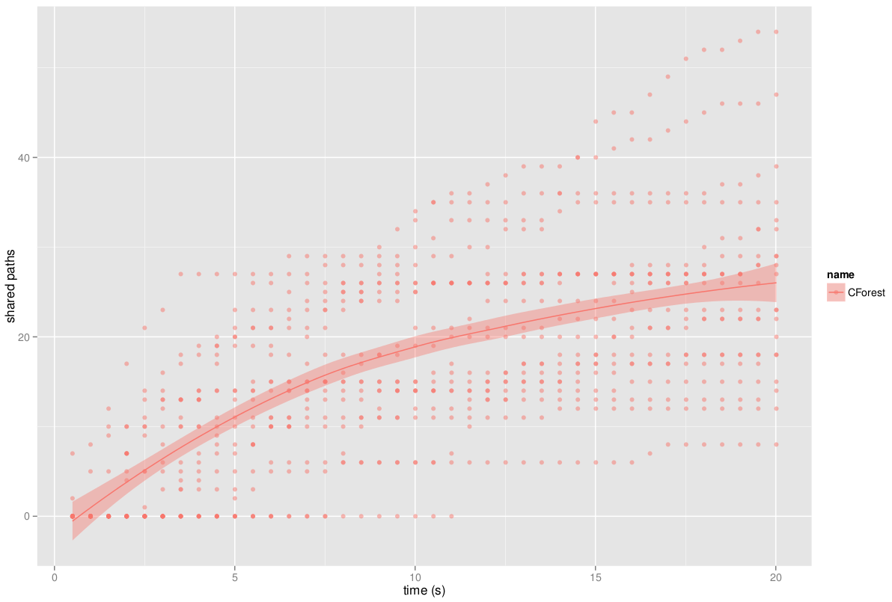

# CForest Parallelization Framework

CForest was proposed by M.Otte and N. Correll in [this paper.](http://www.mit.edu/~ottemw/html_stuff/pdf_files/otte_ieeetro2013.pdf)

The main idea behind CForest is that many trees are built in parallel between the same start and goal states. Each time a better solution is found, it is shared to all other trees. The three main characteristics of CForest are:

- Trees are expanded into regions that are known to be beneficial. Samples that cannot lead to a better solution are immediately discarded.
- Trees are pruned every time a better solution is found. Those states in the tree that do not help to find a better solution are removed from the tree.

CForest is designed to be used with any random tree algorithm under the following assumptions:

1. The search tree has almost sure convergence to the optimal solution.
2. The configuration space obeys the [triangle inequality.](http://en.wikipedia.org/wiki/Triangle_inequality) That is, there exists an admissible heuristic.

## CForest in OMPL

CForest has been included into OMPL as a new [optimizing planner](optimalPlanning.html):

- `ompl::geometric::CForest`

Currently, CForest is implemented with RRT* (ompl::geometric::RRTstar) as underlying planner, since it is the only single-query, incremental, optimal planning algorithm available.

The CForest planner is the responsible of coordinating the different trees and sharing the solutions found. Path sharing is done through a specific CForest state sampler (ompl::base::CForestStateSampler). This sampler allows to add states to sample: if a state has been added to the sampler, it will _sample_ it in the following call to \c sampleUniform() (or any of the other sampling calls).

From the user perspective, CForest can be used is any other planning algorithm:

~~~{.cpp}
// Setting up the planning problem with SimpleSetup
SimpleSetup ss;
...
ompl::base::PlannerPtr planner(new ompl::geometric::CForest(ss.getSpaceInformation()));
ss.setPlanner(planner);
...
~~~

By default, it will use 2 instances of RRT*. The number of instances and the underlying planner can be modified calling the \c addPlannerInstances<T>() method:

~~~{.cpp}
ompl::base::PlannerPtr planner(new ompl::geometric::CForest(ss.getSpaceInformation()));
// Setting up CForest to expand 5 trees of RRTstar.
planner->as<ompl::geometric::CForest>()->addPlannerInstances<ompl::geometric::RRTstar>(5);
~~~

The call \c addPlannerInstances<T>() will check the planner type given with the \c activateCForest() method. All planners that support CForest should have this method implemented. Otherwise, the following error will appear during compilation (test with PRM*):

~~~{.cpp}
planner->as<ompl::geometric::CForest>()->addPlannerInstances<ompl::geometric::PRMstar>(2);
~~~
    /ompl/src/ompl/geometric/planners/cforest/CForest.h:76:21: error: ‘class ompl::geometric::PRMstar’ has no member named ‘activateCForest’
                     planner->as<T>()->activateCForest();
                     ^

\note No Python bindings are available at the moment for this planner due to its multithreaded implementation.

### Main differences with the paper version
When implementing CForest, the focus was modify the underlying planner as less as possible. Although the main idea of CForest remains, the actual implementation differs from the one proposed in the paper:

- No message passing is used. But shared memory and boost::threads are employed.
- The paper creates two different versions: sequential (many trees expanding in the same CPU) and parallel (1 tree per CPU). Since boost::threads are used, the trees/CPU division is done by the scheduler.
- Originally, shared states are treated in a slightly different way than randomly sampled states. Due to the CForestStateSampler encapsulation, all states are treated the same way. This can imply that shared states are not included in other trees. However, tests showed that this does not imply a high impact on performance.
- Sampling bounds are not explicitly set. Samples are created and then checked to know if they can lead to a better solution using the established heuristic.
- Start and goal states are not included in the shared paths in order to keep code simpler.
- Before pruning a tree, it is checked how many states would be removed. If the ratio size new tree/size old tree is not small enough, pruning will not be carried out. This allows to save time since the creation of a NearestNeighbors datastructure is time consuming and sometimes, just a few states are being removed.

### Results
Note that CForest does not imply to find a first solution faster than the underlying planner used. However, it guarantees a probabilistic speed up in the optimization convergence.

The following images show the performance of CForest, using 2 RRTstar threads, in comparison with the standard RRTstar, solving the Alpha 1.5 puzzle.

\htmlonly

   
<b>Best cost evolution through time</b> CForest converges faster towards the minimum cost (optimal solution).

   
<b>Number of paths shared by CForest.</b>

\endhtmlonly

A [CForest demo](CForestDemo_8cpp_source.html) is available.

### Advanced information
#### Implementation details
The CForest _planner_ comes together with its own state sampler ompl::base::CForestStateSampler and its own state space ompl::base::CForestStateSpace. They are completely transparent to the user as the ompl::geometric::CForest handles the creation of these.

CForest operates on the user specified ompl::base::SpaceInformation. However, CForest instantiates the underlying planners with an individual SpaceInformation instance for each planner, containing an instance of a CForestStateSpace. When the underlying planner allocates the StateSampler, CForestStateSpace creates an instance of a CForestStateSampler which wraps the user specified state sampler (or the default sampler if none was provided).

Therefore, CForest tracks the creation of the planners but, thanks to the CForestStateSpace, it also tracks the creation of the state samplers as well. This allows to have a planner-sampler correspondence required to shared paths between trees.

#### Limitations
- CForest is designed to solve single-query, shortest path planning problems. Therefore, not all the ompl::base::OptimizationObjective instantiations are valid. The cost metric have to obey the triangle inequiality. It is important to note that shortest path planning does not mean that only the path length can be optimized. Other metrics could be specified: time, energy, etc. However, clearance or smoothness optimization are examples of non-valid optimization objetives.

- Whenever the tree is pruned, the states are removed from the NearestNeighbours data structure. However, current implementation does not remove pruned states until the planner instance is destroyed. This is specific for the underlying planner implementations but this is the most efficient way in terms of computation time.

#### Make your planner CForest-compatible
If you have implemented an __incremental, optimizing planner__ in OMPL and want make it complatible with CForest, there are few modifications you should carry out on your planner.

There are three main components that should be included:
- CForest activation and configuration.
- Path sharing.
- Tree pruning.

##### CForest activation and configuration
Firstly, your planner needs to know it will work under the CForest framework. Therefore, in the solve() function, you need to add the following code:

~~~{.cpp}
ompl::geoemtric::MyPlanner solve(const base::PlannerTerminationCondition &ptc)
{
    // Configuration before entering the main solving loop.
    ....
    bool isCForest = false;
    bool prune = true;
    const base::CForestStateSpace *cfspace = dynamic_cast<base::CForestStateSpace*>(si_->getStateSpace().get());
    if (cfspace)
    {
        isCForest = true;
        prune = cfspace->getCForestInstance()->getPrune();
    }
    ...
    while (ptc == false) // Main loop
    ...
}
~~~

If the CForest framework is being used, the state space of the MyPlanner instance will be of type CForestStateSpace. Therefore, it is possible to activate the two different flags we need for the CForest: _isCForest_ and _prune_. _isCForest_ controls the part of the code related to path sharing and _prune_ that part related to tree pruning and early state rejection.

\note Note that both flags are independent, so CForest can be used wihtout pruning, _vice-versa_. In this case, the prune flag is activated only if the CForest::setPrune(true) method was called (it is activated by default).

##### Path sharing
As CForest is designed to incremental, optimizing planners, it is assume you will have a flag in your code to indicate when a new, better path has been found and a pointer to the motion which contains the last state (goal) of the solution. Therefore, at the end of the main loop within the solve function, you should add a code similar to the following:

~~~{.cpp}
ompl::geoemtric::MyPlanner solve(const base::PlannerTerminationCondition &ptc)
{
    // Configuration before entering the main solving loop.
    ...
    while (ptc == false) // Main loop
    {
        ...
        // Sampling new states.
        ...
        // Addind states to the tree.
        ...
        // Searching for improved solutions.
        ...
		if (updatedSolution)
        {
            ...
            if (isCForest)
            {
                std::vector<const base::State *> spath;
                Motion *intermediate_solution = solution->parent;

                do
                {
                    spath.push_back(intermediate_solution->state);
                    intermediate_solution = intermediate_solution->parent;
                } while (intermediate_solution->parent != 0);

                pdef_->getIntermediateSolutionCallback()(this, spath, bestCost_);
            }
        } // if updated solution
    } // while ptc
}
~~~

\note The spath vector has to contain the states of the solution from the goal to the start.

In this case, the goal and start states are not being included since it is harder to deal with those two states. Code simplicity prevails.

It is likely to share more than one path in which one or more states are modified. This would imply that the tree and solution path would have repeated states. To avoid this, add the following code within the solve() method just after sampling a new state:

~~~{.cpp}
ompl::geoemtric::MyPlanner solve(const base::PlannerTerminationCondition &ptc)
{
    // Configuration before entering the main solving loop.
    ...
    while (ptc == false) // Main loop
    {
        // Sample a new state and store it in rmotion.
        ...
        // find closest state in the tree
        Motion *nmotion = nn_->nearest(rmotion);
        if (isCForest && si_->equalStates(nmotion->state, rstate))
            continue;
        ...
    }
}
~~~

If a sampled state is repeated it will be discarded and the next iteration of the main loop will start.

##### Tree pruning
Tree and stated can be pruned in two different ways: 1) prune those states of the tree that do not lead to a better solution and 2) not including in the tree those states, so they are not pruned afterwards. In both cases, all the modifications are again within the solve() method. Tree main modifications are done:

1. Check if random samples can lead to a better solution (cost used: heuristic from start to state + heuristic from state to goal).
2. Most of the states satisfy 1., but once they are wired into the tree, they cannot lead to a better solution (cost used: cost to go from start to state + heuristic from state to goal).
3. If a new, better solution is found, prune the states of the tree so that all those states which higher cost than the current best cost are removed.

All these modifications are included in the following code example:

~~~{.cpp}
ompl::geoemtric::MyPlanner solve(const base::PlannerTerminationCondition &ptc)
{
    // Configuration before entering the main solving loop.
    ...
    while (ptc == false) // Main loop
    {
        ...
        // Sampling new states.
        ...
        sampler_->sampleUniform(rstate);

        if (prune) // Modification 1.
        {
            const base::Cost costTotal =  computeLowestCostToGo(rmotion);
            if (opt_->isCostBetterThan(bestCost_, costTotal))
                continue;
        }

        // Addind states to the tree.
        ...
        if (prune) // Modification 2.
        {
            const base::Cost costTotal = computeCostToGoal(motion);
            if (opt_->isCostBetterThan(costTotal, bestCost_))
            {
                nn_->add(motion);
                motion->parent->children.push_back(motion);
            }
            else // If the new motion does not improve the best cost it is ignored.
            {
                si_->freeState(motion->state);
                delete motion;
                continue;
            }
        }
        else // Regular code when prune is not activated.
        {
            // add motion to the tree
            nn_->add(motion);
            motion->parent->children.push_back(motion);
        }
        // Searching for improved solutions.
        ...
		if (updatedSolution)
        {
             ...
             if (prune_) // Modification 3.
                 pruneTree(bestCost_);
             ...
        } // if updated solution
    } // while ptc
}
~~~

For a complete example of how to make these modifications, it is recommended to analyze the [RRTstar::solve() method](RRTstar_8cpp_source.html).