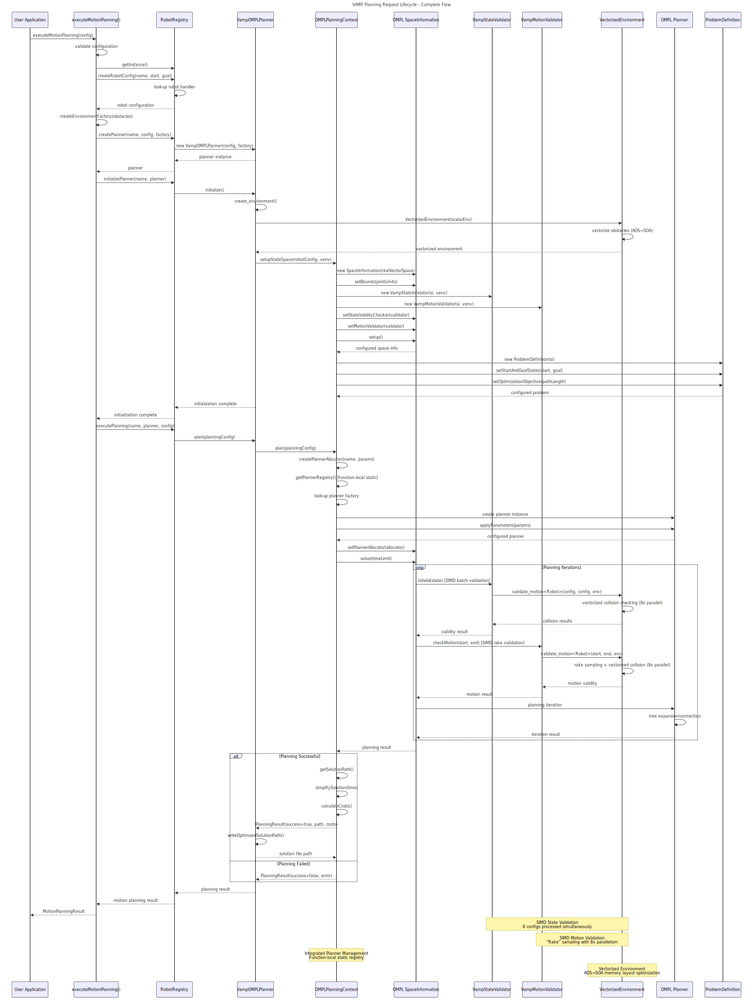

# VAMP-OMPL Architecture {#vamp-ompl-architecture}

This document provides architectural documentation for VAMP-OMPL, which integrates high-performance SIMD collision detection with OMPL's motion planning algorithms.

## Getting Started

For users who want to get started quickly, VAMP-OMPL provides a comprehensive header:

```cpp
#include "VampOmplPlanning.h"

// All functionality is now available
vamp_ompl::PlanningConfiguration config;
auto result = vamp_ompl::executeMotionPlanning(config);
```

The `VampOmplPlanning.h` header includes all necessary components:
- Core interfaces and data structures
- Robot registry with built-in robots (Panda, UR5, Fetch)
- Integrated planner management (RRT-Connect, BIT*, PRM)
- SIMD-accelerated collision detection
- Benchmarking infrastructure
- Visualization support
- All required OMPL and VAMP dependencies

## Architecture Overview

### System Layers

**System Architecture Overview**: 

The VAMP architecture consists of multiple layers:

1. **User Application Layer**: YAML configuration and programmatic APIs
2. **Unified Interface Layer**: Registry-based execution with `executeMotionPlanning()`
3. **Planning Facade Layer**: Main coordination components implementing design patterns
4. **OMPL Integration Layer**: Standard OMPL interfaces with VAMP bridges
5. **VAMP Core Layer**: High-performance SIMD collision detection

### Key Design Patterns

**Class Architecture Patterns**: 

The system employs several design patterns:

- **Registry Pattern**: Runtime robot and planner selection with type safety
- **Facade Pattern**: `VampOMPLPlanner` simplifies complex OMPL integration
- **Factory Pattern**: Environment and robot configuration creation
- **Template Method**: Standardized planning workflow with customization points
- **Dependency Injection**: Constructor-based dependency management

## Core Components

### 1. OMPLPlanningContext - Unified OMPL Integration

The `OMPLPlanningContext` serves as the central OMPL integration point with integrated planner management:

```cpp
template<typename Robot>
class OMPLPlanningContext {
    // OMPL Integration
    void setupStateSpace(const RobotConfig<Robot>& robot_configuration, 
                        const VectorizedEnvironment& vectorized_environment);
    auto plan(const PlanningConfig& planning_configuration) -> PlanningResult;
    
    // Integrated Planner Management
    static void registerPlanner(const std::string& name, PlannerAllocatorFunction allocator);
    static ob::PlannerPtr createPlannerByName(const std::string& name, 
                                             const ob::SpaceInformationPtr& si,
                                             const std::map<std::string, std::string>& parameters);
};
```

**Key Features:**
- **Built-in Planners**: RRT-Connect, BIT*, PRM with automatic parameter handling
- **Extensible Design**: Runtime registration of custom planners
- **Thread Safety**: Function-local static registry with mutex protection
- **Parameter Management**: Automatic OMPL ParamSet integration

### 2. RobotRegistry - Type-Safe Robot Management

The `RobotRegistry` provides runtime robot selection while maintaining compile-time type safety:

```cpp
class RobotRegistry {
    template<typename Robot>
    void registerRobot(const std::string& name);
    
    std::any createRobotConfig(const std::string& robot_name, 
                              std::vector<float> start_config, 
                              std::vector<float> goal_config);
};
```

**Type Safety Mechanism:**
- Templates ensure compile-time type checking
- `std::any` enables runtime polymorphism
- `TypedRobotHandler<Robot>` maintains type safety through type erasure

### 3. VampOMPLPlanner - Planning Facade

The main planning interface that coordinates all components:

```cpp
template<typename Robot>
class VampOMPLPlanner {
    VampOMPLPlanner(std::unique_ptr<RobotConfig<Robot>> robot_configuration,
                    std::unique_ptr<EnvironmentFactory> environment_factory);
    
    void initialize();
    auto plan(const PlanningConfig& planning_configuration) -> PlanningResult;
};
```

**Design Benefits:**
- **Two-Phase Initialization**: Constructor + `initialize()` for error handling
- **Dependency Injection**: Accepts configured dependencies
- **Template Method**: Standardized planning workflow

### 4. VAMP Validators - High-Performance Collision Detection

VAMP validators provide SIMD-accelerated collision detection:

```cpp
template<typename Robot>
class VampStateValidator : public ompl::base::StateValidityChecker {
    bool isValid(const ompl::base::State* state) const override;
};

template<typename Robot>
class VampMotionValidator : public ompl::base::MotionValidator {
    bool checkMotion(const ompl::base::State* s1, const ompl::base::State* s2) const override;
};
```

**Performance Features:**
- **SIMD Vectorization**: Parallel collision checking
- **Function-Local Static**: One converter per template instantiation
- **Thread Safety**: Avoids static initialization order issues

## Planning Request Lifecycle

**Planning Request Sequence**: 

The complete planning workflow:

1. **Configuration Phase**: Load robot and environment configurations
2. **Initialization Phase**: Create OMPL state space and validators
3. **Planning Phase**: Execute motion planning with selected algorithm
4. **Post-Processing Phase**: Path simplification and result formatting

## Registry Architecture

### Robot Registration

**Built-in Robots**: Automatically registered at startup
```cpp
// In RobotRegistry constructor
registerRobot<vamp::robots::Panda>("panda");
registerRobot<vamp::robots::UR5>("ur5");
registerRobot<vamp::robots::Fetch>("fetch");
```

**Custom Robots**: Manual registration via macro
```cpp
REGISTER_VAMP_ROBOT(MyCustomRobot, "my_robot");
```

### Planner Registration

**Built-in Planners**: Integrated within OMPLPlanningContext
```cpp
static std::map<std::string, PlannerAllocatorFunction> createBuiltInPlanners() {
    std::map<std::string, PlannerAllocatorFunction> planners;
    planners["RRT-Connect"] = [](const ob::SpaceInformationPtr& si, const auto& params) {
        auto planner = std::make_shared<ompl::geometric::RRTConnect>(si);
        applyParameters(planner, params);
        return planner;
    };
    // Additional built-in planners...
    return planners;
}
```

**Custom Planners**: Runtime registration
```cpp
OMPLPlanningContext<Robot>::registerPlanner("MyRRT*", 
    [](const ob::SpaceInformationPtr& si, const auto& params) {
        auto planner = std::make_shared<og::RRTstar>(si);
        // Configure parameters...
        return planner;
    });
```

## Performance Characteristics

### SIMD Acceleration

**SIMD Performance Architecture**: 

- **Vectorized Collision Detection**: Up to 8x speedup with AVX2 instructions
- **Batch Processing**: Multiple configurations checked simultaneously  
- **Memory Efficiency**: Optimized data layout for SIMD operations

### Memory Layout Optimization

- **AOS to SOA Conversion**: Transforms OMPL's array-of-structures to VAMP's structure-of-arrays
- **Zero-Copy Operations**: Function-local static buffers eliminate allocations
- **SIMD-Aligned Memory**: Ensures optimal vectorization performance

## Thread Safety

### Registry Thread Safety

The VAMP system provides comprehensive thread safety guarantees:

**Function-Local Static Initialization**:
```cpp
template<typename Robot>
SafeConfigurationConverter<Robot>& get_converter() {
    static SafeConfigurationConverter<Robot> converter;  // C++11 thread-safe
    return converter;
}
```

**Thread Safety Guarantees**:
- **Registry Access**: Read operations are lock-free after initialization
- **Planner Creation**: Function-local static registry with mutex protection
- **SIMD Validators**: Immutable state design ensures thread safety
- **Configuration Conversion**: Per-template-instantiation converters avoid contention

**Best Practices**:
- Initialize registry once at application startup
- Avoid concurrent robot registration after initialization
- SIMD validators are safe for concurrent planning operations

### Static Initialization Order Safety

**Problem Solved**: The system avoids static initialization order fiasco through:
```cpp
// CRITICAL: Function-local static instead of global static
static SafeConfigurationConverter<Robot> converter;  // Lazy initialization
```

**Benefits**:
- Guaranteed initialization on first use
- No dependency on global constructor order
- Exception-safe initialization

### Robot-Specific Parameters

**Performance Tuning Parameters**:
```cpp
struct CustomRobot {
    static constexpr auto dimension = 7;        // Joint count affects memory layout
    static constexpr auto n_spheres = 10;       // Collision complexity
    static constexpr auto resolution = 64;      // Motion validation granularity
};
```

**Tuning Guidelines**:
- **Higher resolution**: More thorough validation, slower performance
- **More spheres**: Better collision accuracy, higher memory usage
- **Dimension**: Linear impact on SIMD efficiency

**Optimization Strategies**:
```yaml
obstacles:
  - type: sphere
    radius: 0.1          # Larger radii reduce collision check count
  - type: pointcloud
    point_radius: 0.005  # Balance accuracy vs performance
```

## Extension Points

### Custom Robot Integration

```cpp
// Define robot traits
template<>
struct RobotTraits<MyRobot> {
    static constexpr size_t dimension = 6;
    static constexpr size_t n_spheres = 8;
    // Additional traits...
};

// Register robot
REGISTER_VAMP_ROBOT(MyRobot, "my_robot");
```

### Custom Environment Factories

```cpp
class MyEnvironmentFactory : public EnvironmentFactory {
    auto create_environment() -> vamp::collision::Environment<float> override;
    auto get_environment_name() const -> std::string override;
    auto get_description() const -> std::string override;
};
```

### Custom Planner Integration

```cpp
// Register at runtime
OMPLPlanningContext<Robot>::registerPlanner("MyPlanner",
    [](const ob::SpaceInformationPtr& si, const auto& params) {
        return std::make_shared<MyCustomPlanner>(si);
    });
```
