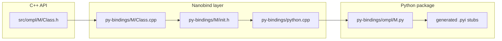

# Complete Missing OMPL Python Bindings Plan

> **Repository:** `/home/joao/my_repos/forks/ompl` (`git@github.com:joao-pm-santos96/ompl.git`)
> **Work branch:** `feat/python-bindings-gap`
> **Status:** Implemented on `feat/python-bindings-gap` (eight phase commits)
> **Delivery:** single PR to `main`, one commit per phase (0–7)
> **Upstream reference:** OMPL main (Nanobind bindings in `py-bindings/`)

## Current State

OMPL 2.x uses **Nanobind** with a single extension module `_ompl` and five Python submodules (`base`, `geometric`, `control`, `util`, `tools`) registered in [`py-bindings/python.cpp`](../../py-bindings/python.cpp). New `.cpp` files under [`py-bindings/`](../../py-bindings/) are auto-discovered by CMake `GLOB_RECURSE` in [`py-bindings/CMakeLists.txt`](../../py-bindings/CMakeLists.txt).

| Area             | C++ headers (approx) | Binding `.cpp` files | Coverage                                      |
| ---------------- | -------------------- | -------------------- | --------------------------------------------- |
| `base`           | 95                   | 87+                  | Public API complete; intentional template gaps |
| `geometric`      | 86 (many internal)   | 53+                  | All bindable planners/utilities bound         |
| `control`        | 36                   | 36+                  | Complete except `ODEAdaptiveSolver` (Boost)   |
| `tools`          | 15                   | 11+                  | Bindable API complete; GIL orchestrators out  |
| `util`           | 11                   | 7+                   | Complete                                      |
| `multilevel`     | 61                   | 34+                  | Submodule + planners + infrastructure           |
| `datastructures` | 16                   | 0                    | Internal; skip unless exposed via API         |
| `vamp`           | 4                    | 0                    | Optional separate build                       |

**Binding pattern to follow:** mirror C++ header path, implement `init*` in namespace `ompl::binding::<module>`, declare in `init.h`, register in `python.cpp` **after base types** (inheritance order matters — see Nanobind note in [`py-bindings/README.md`](../../py-bindings/README.md)). Planner template from [`py-bindings/geometric/planners/rrt/RRT.cpp`](../../py-bindings/geometric/planners/rrt/RRT.cpp): constructor, dual-typed `solve()`, `getPlannerData`, `clear`, `setup`, planner-specific setters.



---

## GIL / Threading Exclusion Policy

Per [`doc/markdown/python.md`](../../doc/markdown/python.md#py_good_practices): C++ threads calling into Python without GIL management cause deadlocks/crashes. **Do not add bindings for:**

| Class                                                          | Location                      | Reason                           |
| -------------------------------------------------------------- | ----------------------------- | -------------------------------- |
| `ParallelPlan`                                                 | `tools/multiplan/`            | Spawns `std::thread` per planner |
| `OptimizePlan`                                                 | `tools/multiplan/`            | Wraps `ParallelPlan`             |
| `CForest` + `CForestStateSpaceWrapper` + `CForestStateSampler` | `geometric/planners/cforest/` | Multi-threaded planner pool      |
| `pRRT`                                                         | `geometric/planners/rrt/`     | Parallel RRT threads             |
| `pSBL`                                                         | `geometric/planners/sbl/`     | Parallel SBL threads             |
| `AnytimePathShortening`                                        | `geometric/planners/`         | Parallel planner pool            |
| `Lightning`, `Thunder`, `ExperienceSetup`                      | `tools/`                      | Internally use `ParallelPlan`    |
| `Profiler`, `PlannerMonitor`                                   | `tools/debug/`                | Background monitor threads       |

**Document-only (already bound or bindable with warning):**

- `Benchmark` — already bound; uses background threads. Keep; document that Python validity/propagation callbacks are unsafe during benchmark runs.
- `PRM`, `LazyPRM`, `SPARS`, `SPARStwo` — optional solution-check threads (`specs_.multithreaded = true`). `PRM` is already bound. For the others: bind but add docstring warning when used with Python `StateValidityChecker` trampolines.

**GIL pattern for Python callbacks:** extend existing trampoline pattern from [`py-bindings/base/StateValidityChecker.cpp`](../../py-bindings/base/StateValidityChecker.cpp) and [`py-bindings/base/objectives/StateCostIntegralObjective.cpp`](../../py-bindings/base/objectives/StateCostIntegralObjective.cpp) (`nb::gil_scoped_acquire`) to any new callback surfaces (`StatePropagator`, `ODESolver` callables, LTL decompositions).

---

## Complete Missing Bindings Inventory

### A. `ompl.base` — 35 items

**State spaces (6)**

- [`HybridStateSpace.h`](../../src/ompl/base/spaces/HybridStateSpace.h), [`HybridTimeStateSpace.h`](../../src/ompl/base/spaces/HybridTimeStateSpace.h)
- Special topologies: [`SphereStateSpace`](../../src/ompl/base/spaces/special/SphereStateSpace.h), [`TorusStateSpace`](../../src/ompl/base/spaces/special/TorusStateSpace.h), [`MobiusStateSpace`](../../src/ompl/base/spaces/special/MobiusStateSpace.h), [`KleinBottleStateSpace`](../../src/ompl/base/spaces/special/KleinBottleStateSpace.h)

**Motion validators (2)**

- [`DubinsMotionValidator.h`](../../src/ompl/base/spaces/DubinsMotionValidator.h), [`Dubins3DMotionValidator.h`](../../src/ompl/base/spaces/Dubins3DMotionValidator.h)

**Valid-state samplers (6)**

- `GaussianValidStateSampler`, `BridgeTestValidStateSampler`, `MinimumClearanceValidStateSampler`, `MaximizeClearanceValidStateSampler`, `ConditionalStateSampler`, `ConstrainedValidStateSampler`

**Informed / deterministic samplers (7)**

- `InformedStateSampler`, `RejectionInfSampler`, `OrderedInfSampler`, `PathLengthDirectInfSampler`
- `DeterministicStateSampler`, `DeterministicSequence`, `HaltonSequence`, `PrecomputedSequence`

**Optimization objectives (7)**

- `MinimizeArrivalTime`, `MechanicalWorkOptimizationObjective`, `VFMechanicalWorkOptimizationObjective`, `MinimaxObjective`, `MaximizeMinClearanceObjective`, `ControlDurationObjective`, `VFUpstreamCriterionOptimizationObjective`

**Termination conditions (2)**

- `CostConvergenceTerminationCondition`, `IterationTerminationCondition`

**Core utilities (5)**

- `DiscreteMotionValidator`, `GenericParam`/`ParamSet` (expose planner parameter introspection), `PrecomputedStateSampler`, `StateStorage`, `PlannerDataGraph`

**Fix existing:** [`GoalLazySamples`](../../py-bindings/base/goals/GoalLazySamples.cpp) — bound but reported broken; add pytests and fix `GoalSamplingFn` / callback trampoline.

---

### B. `ompl.geometric` — 44 bindable items

**Path utilities (3)**

- [`PathHybridization.h`](../../src/ompl/geometric/PathHybridization.h), [`HillClimbing.h`](../../src/ompl/geometric/HillClimbing.h), [`GeneticSearch.h`](../../src/ompl/geometric/GeneticSearch.h)

**Planners — EST/KPIECE-adjacent (6)**

- `EST`, `BiEST`, `ProjEST`, `SST`, `PDST`, `SBL`

**Planners — RRT family (14)**

- `LazyRRT`, `LBTRRT`, `LazyLBTRRT`, `TRRT`, `TRRTstar`, `BiTRRT`, `TSRRT`, `ATRRT`, `VFRRT`, `STRRTstar`, `RRTXstatic`, `RRTsharp`, `AOXRRTConnect`, `RLRT`, `BiRLRT`

**Planners — PRM family (4)**

- `LazyPRM`, `LazyPRMstar`, `SPARS`, `SPARStwo` (with threading doc warning)

**Planners — informed trees (5)** — register in order:

1. `ABITstar` (extends `BITstar`, already bound)
2. `AITstar`, `EITstar` (both extend `Planner`)
3. `EIRMstar` (extends `EITstar` — **must come after EITstar**)
4. `BLITstar`

**Planners — other (4)**

- `STRIDE`, `XXL` + `XXLDecomposition`, `XXLPlanarDecomposition`, `XXLPositionDecomposition`

**Experience repair (2)** — bind without `Lightning`/`Thunder` orchestrators:

- `LightningRetrieveRepair`, `ThunderRetrieveRepair`

**Excluded (6):** `pRRT`, `pSBL`, `CForest`, `CForestStateSpaceWrapper`, `CForestStateSampler`, `AnytimePathShortening`

---

### C. `ompl.control` — 14 items

**Core (4)**

- `ODESolver`, `ODEBasicSolver`, `ODEErrorSolver`, `ODEAdaptiveSolver` — trampolines for user-defined ODE callables + GIL
- `DiscreteControlSpace`, `SteeredControlSampler`, `PlannerDataStorage`

**Planners (2)**

- `HyRRT`, `HySST`

**LTL stack (7)**

- `LTLPlanner`, `LTLProblemDefinition`, `LTLSpaceInformation`, `PropositionalDecomposition`, `Automaton`, `World`, `ProductGraph`

---

### D. `ompl.util` — 4 items

- [`ProlateHyperspheroid.h`](../../src/ompl/util/ProlateHyperspheroid.h) — **high priority** (needed by informed sampling demos)
- `GeometricEquations`, `Time`, `Exception`

---

### E. `ompl.tools` — 6 bindable items

- `SelfConfig`, `MagicConstants`
- `LightningDB`, `ThunderDB`, `SPARSdb`, `DynamicTimeWarp`
- `machine::getProcessMemoryUsage`, `getHostname`, `getCPUInfo` (free functions from benchmark module)

**Excluded (7):** `ParallelPlan`, `OptimizePlan`, `Lightning`, `Thunder`, `ExperienceSetup`, `Profiler`, `PlannerMonitor`

---

### F. `ompl.multilevel` — new submodule (~20 public-facing items)

Entire namespace is in the core library ([`src/ompl/CMakeLists.txt`](../../src/ompl/CMakeLists.txt)) but has **zero bindings**.

**Public planners (4 type aliases):**

- `QRRT`, `QRRTStar`, `QMP`, `QMPStar` — each is `using X = BundleSpaceSequence<XImpl>` ([`QRRT.h`](../../src/ompl/multilevel/planners/qrrt/QRRT.h))

**Required infrastructure (bind before planners):**

- `PlannerMultiLevel`, `BundleSpace`, `BundleSpaceGraph`, `BundleSpaceSequence` (explicit template instantiations for each impl type)
- `Projection`, `ProjectionFactory`, common projection classes (`SE2_R2`, `SE3_R3`, `RN_RM`, `Identity`, etc.)
- `Parameter`, `ParameterExponentialDecay`, `ParameterSmoothStep`
- `BundleSpaceImportance` + Uniform/Greedy/Exponential variants

**Skip internal-only headers:** `*Impl.h`, `Head.h`, `PathSection.h`, `FindSectionTypes.h`, individual graph sampler internals unless needed for customization.

**Build changes required:**

- Add `py-bindings/multilevel/` tree + `py-bindings/ompl/multilevel.py`
- Extend CMake `GLOB` and stub generation in [`py-bindings/CMakeLists.txt`](../../py-bindings/CMakeLists.txt)
- Register `nb::module_ multilevel` in `python.cpp`

---

### G. Optional / Out of Scope (unless explicitly requested)

- **`ompl::vamp`** — separate optional dependency; follow `VAMP_BUILD_PYTHON_BINDINGS` pattern
- **`extensions/triangle`** — gated by `OMPL_EXTENSION_TRIANGLE`
- **`datastructures/*`** — template containers; only bind if a public API requires direct Python access (e.g. via `SelfConfig` NN selection)
- **Internal planner headers** (`bitstar/Vertex.h`, `eitstar/Edge.h`, etc.) — never bind

---

## Delivery Strategy

All binding work lands in **one PR** on branch `feat/python-bindings-gap` → `main`. Phases 0–7 are logical work units and map **one-to-one to commits** (not separate PRs). See [`python-bindings-execution.plan.md`](python-bindings-execution.plan.md) for commit message format and verification gates.

Phase 6 (multilevel) is the highest-risk commit — land it only after Phases 1–5 are green on the branch.

---

## Implementation Phases

### Phase 0 — Tooling and policy (1–2 days)

- [x] Add maintenance script `scripts/list_binding_gaps.py` that diffs `src/ompl/**/*.h` vs `py-bindings/**/*.cpp` (excluding `*Impl.h`, internal dirs) and prints the gap list; run in CI to prevent drift.
- [x] Document GIL exclusion list in [`doc/markdown/python.md`](../../doc/markdown/python.md) under a new **"Excluded from Python bindings"** section.
- [x] Establish code-gen helper: copy [`RRT.cpp`](../../py-bindings/geometric/planners/rrt/RRT.cpp) as planner skeleton to reduce boilerplate.

### Phase 1 — High-value base + util (1 week)

- [x] `ProlateHyperspheroid`
- [x] Remaining optimization objectives + termination conditions
- [x] Informed samplers (`PathLengthDirectInfSampler`, etc.)
- [x] Additional valid-state samplers
- [x] `HybridStateSpace`, `HybridTimeStateSpace`, special topologies
- [x] Fix `GoalLazySamples` + tests

### Phase 2 — Geometric planners batch 1 (1–2 weeks)

Bind in dependency-safe sub-batches within the Phase 2 commit:

- [x] **Classic:** EST, BiEST, ProjEST, SST, SBL, PDST, STRIDE
- [x] **RRT variants:** LazyRRT, LBTRRT, TRRT family, STRRTstar, etc.
- [x] **PRM variants:** LazyPRM*, SPARS* (with warnings)
- [x] **Path tools:** PathHybridization, HillClimbing, GeneticSearch

Each planner: binding file + one smoke test in [`tests/pytests/test_geo_planners.py`](../../tests/pytests/test_geo_planners.py).

### Phase 3 — Informed-tree planners (3–5 days)

Strict registration order in `python.cpp`:

```
BITstar (existing) → ABITstar → AITstar → EITstar → EIRMstar → BLITstar
```

- [x] ABITstar, AITstar, EITstar, EIRMstar, BLITstar

### Phase 4 — Control extensions (1 week)

- [x] `DiscreteControlSpace`, `SteeredControlSampler`, `PlannerDataStorage`
- [x] ODE solver hierarchy with GIL-aware trampolines; port [`demos/deprecated/RigidBodyPlanningWithODESolverAndControls.py`](../../demos/deprecated/RigidBodyPlanningWithODESolverAndControls.py) to active demo (`demos/RigidBodyPlanningWithODESolverAndControls.py`)
- [x] `HyRRT`, `HySST`
- [x] LTL stack

> **Note:** `ODEAdaptiveSolver` is intentionally excluded (Boost 1.83 `make_controlled` compile failure). Use `ODEBasicSolver` / `ODEErrorSolver` from Python instead.

### Phase 5 — Tools (3–4 days)

- [x] `SelfConfig`, `MagicConstants`
- [x] Experience DB classes (`LightningDB`, `ThunderDB`, `SPARSdb`, `DynamicTimeWarp`) without binding orchestrators that use `ParallelPlan`
- [x] `LightningRetrieveRepair`, `ThunderRetrieveRepair` in geometric
- [x] `XXL` decomposition types

### Phase 6 — Multilevel submodule (2–3 weeks, highest complexity)

- [x] Scaffold `py-bindings/multilevel/` module infrastructure
- [x] Bind `Projection` hierarchy + `ProjectionFactory`
- [x] Explicitly instantiate and bind `BundleSpaceSequence<QRRTImpl>`, etc. as concrete Python classes named `QRRT`, `QRRTStar`, `QMP`, `QMPStar`
- [x] Revive/update [`demos/multilevel/`](../../demos/multilevel/) demos to use `from ompl import multilevel` (`demos/multilevel/MultiLevelPlanningRigidBody2D.py`)
- [x] Dedicated `tests/pytests/test_multilevel_planners.py`

### Phase 7 — CI, stubs, docs (ongoing)

- [x] Expand [`tests/pytests/`](../../tests/pytests/) for every new binding (target: import + construct + `solve` smoke test)
- [x] Verify `.pyi` stub generation still passes `fix_pyi_imports.cmake`
- [x] Update [`doc/markdown/pybindingsPlanner.md`](../../doc/markdown/pybindingsPlanner.md) with multilevel and ODE examples

---

## Per-Binding Checklist (repeat for each class)

1. Create `py-bindings/<module>/.../<Class>.cpp` mirroring C++ path
2. Declare `init*` in `<module>/init.h`
3. Register in `python.cpp` after dependencies
4. For planners: dual `solve(PlannerTerminationCondition | double)` overload via lambda (see RRT pattern)
5. For Python-overridable virtuals: `NB_TRAMPOLINE` + `nb::gil_scoped_acquire` in overrides
6. Add pytest smoke test
7. Run `pip install ./py-bindings` and verify stub import

---

## Effort Summary

| Phase                   | New binding files (approx) | Risk                                                            |
| ----------------------- | -------------------------- | --------------------------------------------------------------- |
| 0 Tooling               | 0                          | Low                                                             |
| 1 Base + util           | ~25                        | Low–medium (Eigen/numpy for constrained spaces already handled) |
| 2 Geometric planners    | ~35                        | Low (mechanical)                                                |
| 3 Informed trees        | ~5                         | Medium (inheritance order)                                      |
| 4 Control               | ~14                        | Medium–high (ODE/LTL callbacks)                                   |
| 5 Tools + experience    | ~10                        | Medium                                                          |
| 6 Multilevel            | ~20                        | **High** (templates, new submodule)                             |
| **Total bindable**      | **~110**                   |                                                                 |
| **Explicitly excluded** | **~15**                    | GIL safety                                                      |

Recommended delivery: **one PR** (`feat/python-bindings-gap` → `main`) with **eight commits** (Phases 0–7). Phase 6 (multilevel) remains the highest-risk commit; land it only after Phases 1–5 are green.
